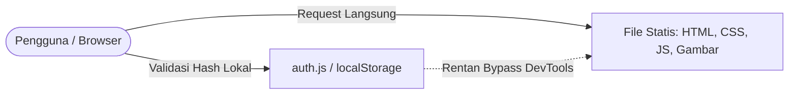
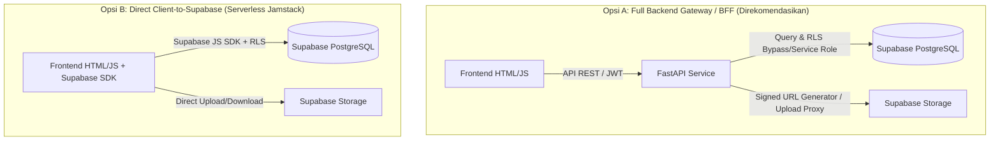
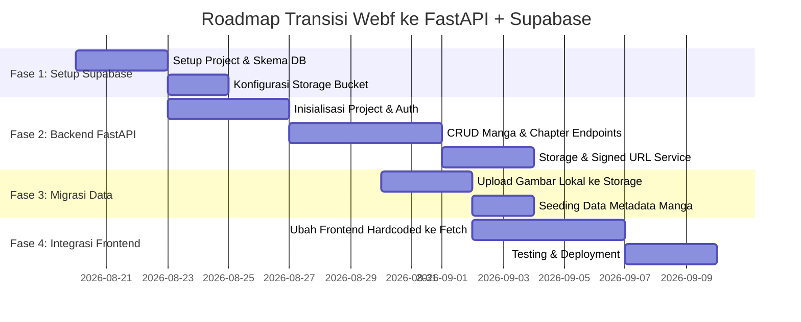
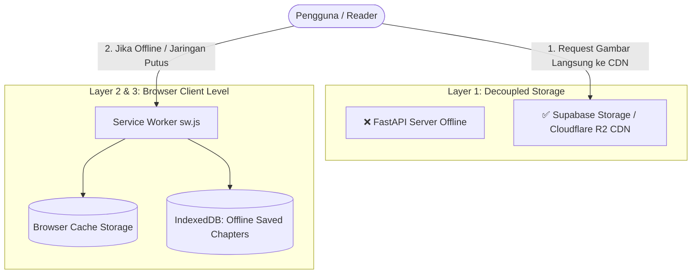

# Analisis & Solusi Migrasi Web Statis ke FastAPI + Supabase

Dokumen ini memuat analisis mendalam terkait rencana transisi website dari web statis murni (*hardcoded HTML + client-side auth*) menjadi aplikasi modern berbasis backend **Python FastAPI** dan database/storage **Supabase (PostgreSQL)**.

---

## 1. Analisis Kondisi Saat Ini (Current State)



### Karakteristik & Keterbatasan Web Sekarang:
1. **Keamanan Lemah (Client-side Auth):** Autentikasi di `auth.js` dan `credentials.json` berjalan di browser. Siapa saja dapat membuka file gambar atau halaman HTML langsung via URL tanpa verifikasi server.
2. **Konten Hardcoded:** Setiap manga baru atau chapter baru memerlukan pembuatan file HTML baru secara manual (misal: `pages_mangaid12.html`, `pages_mangaid13.html`).
3. **Penyimpanan Aset Lokal:** Gambar manga tersimpan langsung di folder lokal (`images12/`, `images13/`, dll.) yang membuat ukuran repository membengkak dan sulit di-cache secara optimal.
4. **Tidak Ada Manajemen State:** Tidak ada fitur bookmark, riwayat baca pengguna, analitik pembaca, atau kontrol hak akses dinamis.

---

## 2. Kelebihan & Kekurangan (Pros & Cons)

### ✅ Kelebihan Menggunakan FastAPI + Supabase

| Aspek | Manfaat |
| :--- | :--- |
| **Keamanan Terjamin** | Auth dihandle di server (*JWT Token / HttpOnly Cookie*). File gambar dilindungi melalui *Private Buckets & Signed URLs*. |
| **Manajemen Konten Dinamis (CRUD)** | Tambah/edit/hapus manga dan chapter via Admin API/Dashboard tanpa perlu deploy ulang file HTML. |
| **Kinerja & Kecepatan Tinggi** | FastAPI berbasis `asyncio` dan ASGI (Uvicorn), sangat cepat dan hemat resource CPU/RAM. |
| **Database Relasional Skalabel** | Supabase menyediakan PostgreSQL kelas industri dengan fitur canggih (*indexing, full-text search, automatic backups*). |
| **Storage Terintegrasi** | Supabase Storage mendukung upload gambar manga, kompresi, CDN bawaan, dan kontrol akses per user. |
| **Fitur Masa Depan Terbuka** | Mudah menambahkan fitur interaktif: bookmark/favorit, rating/komentar, tracking progress baca, dan role-based access (Free vs VIP/Subscriber). |
| **Dokumentasi Otomatis** | FastAPI secara otomatis menyediakan OpenAPI Swagger UI (`/docs`) untuk kemudahan testing endpoint. |

---

### ⚠️ Kekurangan & Tantangan

| Aspek | Tantangan & Mitigasi |
| :--- | :--- |
| **Kompleksitas Infrastruktur** | Butuh hosting/server terpisah untuk FastAPI (misal: VPS, Railway, Render, Fly.io, atau Google Cloud Run), tidak lagi bisa sekadar di-hosting di GitHub Pages / Netlify statis. |
| **Biaya Operasional (Bila Trafik Besar)** | Supabase free tier sangat royal (500MB DB, 1GB Storage, 2GB bandwidth transfer), namun jika volume gambar manga mencapai puluhan gigabyte, perlu upgrade ke plan berbayar atau integrasi Cloudflare R2 / AWS S3. |
| **Cold Start (Jika Serverless Hosting)** | Jika FastAPI di-host di platform serverless gratisan (misal Render free tier), bisa ada delay beberapa detik saat request pertama setelah idle. (*Mitigasi: Pakai VPS murah / container always-on*). |
| **Kebutuhan Maintenance Kode** | Memerlukan pemeliharaan dua sisi (Frontend client dan Backend Python service). |

---

## 3. Pilihan Arsitektur Solusi

Ada 2 pola implementasi yang bisa dipilih:



### Perbandingan Opsi:

* **Opsi A (FastAPI + Supabase - Direkomendasikan jika):**
  * Ingin logika bisnis rahasia (enkripsi URL aset, proteksi scraper manga, rate-limiting kustom, background watermark processing).
  * Ingin kontrol penuh atas autentikasi dan API contract.
  * Ingin kemampuan integrasi Python (misal AI image processing, automated manga scraper/downloader, OCR terjemahan).
* **Opsi B (Supabase Langsung dari JS):**
  * Cocok jika ingin arsitektur tanpa backend server sama sekali (mengandalkan PostgreSQL Row Level Security / RLS).

---

## 4. Desain Arsitektur Teknis (Target State)

### 4.1. Skema Database Supabase (PostgreSQL)

```sql
-- 1. Tabel Profil User / Auth
create table profiles (
  id uuid references auth.users on delete cascade primary key,
  username text unique not null,
  hashed_password text not null,
  role text default 'member' check (role in ('admin', 'vip', 'member')),
  created_at timestamp with time zone default timezone('utc'::text, now()) not null
);

-- 2. Tabel Manga (Metadata)
create table mangas (
  id uuid default gen_random_uuid() primary key,
  slug text unique not null,
  title text not null,
  creator text,
  genre text[],
  description text,
  cover_image_url text,
  is_published boolean default true,
  created_at timestamp with time zone default timezone('utc'::text, now()) not null,
  updated_at timestamp with time zone default timezone('utc'::text, now()) not null
);

-- 3. Tabel Chapters
create table chapters (
  id uuid default gen_random_uuid() primary key,
  manga_id uuid references mangas(id) on delete cascade not null,
  chapter_number numeric not null,
  title text,
  created_at timestamp with time zone default timezone('utc'::text, now()) not null
);

-- 4. Tabel Halaman/Gambar Chapter
create table chapter_pages (
  id uuid default gen_random_uuid() primary key,
  chapter_id uuid references chapters(id) on delete cascade not null,
  page_number int not null,
  image_path text not null, -- path di Supabase Storage
  created_at timestamp with time zone default timezone('utc'::text, now()) not null,
  unique(chapter_id, page_number)
);

-- 5. Tabel Riwayat Baca / Bookmark
create table user_bookmarks (
  id uuid default gen_random_uuid() primary key,
  user_id uuid references profiles(id) on delete cascade not null,
  manga_id uuid references mangas(id) on delete cascade not null,
  last_chapter_id uuid references chapters(id),
  updated_at timestamp with time zone default timezone('utc'::text, now()) not null,
  unique(user_id, manga_id)
);
```

---

### 4.2. Desain Struktur Folder Proyek Backend (FastAPI)

```text
webf/
├── backend/
│   ├── app/
│   │   ├── __init__.py
│   │   ├── main.py              # Inisialisasi FastAPI & Middleware (CORS, etc.)
│   │   ├── config.py            # Pydantic Settings (.env loader)
│   │   ├── dependencies.py      # Dependency injection (Auth guard, Supabase Client)
│   │   ├── api/
│   │   │   ├── v1/
│   │   │   │   ├── auth.py      # Login, Register, Refresh Token
│   │   │   │   ├── mangas.py    # List manga, detail, search
│   │   │   │   ├── chapters.py  # Baca chapter, fetch pages (signed URLs)
│   │   │   │   └── admin.py     # Upload manga, upload chapter zip/images
│   │   ├── models/              # Pydantic schemas (Request & Response)
│   │   │   ├── manga.py
│   │   │   └── user.py
│   │   └── services/
│   │       ├── supabase_svc.py  # Interaksi DB & Storage Supabase
│   │       └── auth_svc.py      # Hashing, JWT validator
│   ├── requirements.txt
│   ├── Dockerfile
│   └── .env.example
├── docs/
│   └── migration.md
├── frontend/                     # Web statis yang dimodernisasi
│   ├── index.html
│   ├── login.html
│   ├── reader.html              # Template dinamis untuk baca chapter
│   ├── js/
│   │   ├── api.js               # Fetch wrapper ke FastAPI
│   │   ├── auth.js              # Token handler
│   │   └── reader.js            # Lazy loading gambar reader
│   └── css/
```

---

### 4.3. Daftar Endpoint API (FastAPI)

```mermaid
classDiagram
    class AuthAPI {
        +POST /api/v1/auth/login
        +POST /api/v1/auth/register
        +GET /api/v1/auth/me
    }
    class MangaAPI {
        +GET /api/v1/mangas (filter, pagination, search)
        +GET /api/v1/mangas/{slug}
        +GET /api/v1/mangas/{slug}/chapters
        +GET /api/v1/chapters/{id}/pages (protected signed URLs)
    }
    class BookmarkAPI {
        +GET /api/v1/bookmarks
        +POST /api/v1/bookmarks/{manga_id}
    }
    class AdminAPI {
        +POST /api/v1/admin/mangas
        +POST /api/v1/admin/chapters/upload-batch
    }
```

---

## 5. Rencana Eksekusi Bertahap (Migration Roadmap)



### Langkah Praktis Migrasi:
1. **Fase 1: Setup Supabase**
   * Buat akun di Supabase dan buat project baru.
   * Eksekusi script SQL skema tabel di SQL Editor.
   * Buat Storage Bucket bernama `manga-assets` (status: *Private* agar gambar aman).

2. **Fase 2: Bangun Service FastAPI**
   * Gunakan library `supabase-py` / `httpx` dan `pydantic` v2.
   * Implementasi endpoint untuk menyajikan daftar manga dinamis dan menghasilkan *Signed URL* berjangka (misal berlaku 1 jam) agar link gambar tidak bisa di-hotlink sembarangan.

3. **Fase 3: Migrasi Aset Gambar**
   * Buat script Python singkat (CLI uploader) untuk membaca folder `images12/`, `images13/`, dll., menguploadnya ke Supabase Storage, dan mengisi tabel `mangas`, `chapters`, serta `chapter_pages`.

4. **Fase 4: Perbarui Frontend**
   * Ganti `home.html` yang hardcoded dengan looping data dinamis dari `GET /api/v1/mangas`.
   * Ganti halaman `pages_mangaidXX.html` dengan satu file `reader.html?slug=manga-12&chapter=1` yang memuat gambar secara dinamis dengan fitur infinite scroll / paginasi.

---

## 6. Strategi Ketersediaan Tinggi & Akses Gambar Saat Server Offline

Pertanyaan penting dalam arsitektur modern: *Bagaimana jika server backend FastAPI sedang offline, restart, atau down? Apakah pengguna tetap bisa membaca manga?*

Jawabannya: **Bisa, dengan 4 layer strategi berikut:**



### 6.1. Pemisahan Server API dan Storage Gambar (Decoupled Architecture)
* Server FastAPI **hanya** bertindak sebagai perantara logika, validasi auth, dan penyaji JSON metadata.
* Semua file gambar manga disimpan di **Supabase Storage** atau **Cloudflare R2** yang didukung jaringan CDN global (Uptime SLA 99.99%).
* **Dampaknya:** Jika server FastAPI mati total, URL gambar yang sudah di-load browser tetap 100% aktif dan dapat diakses tanpa hambatan.

### 6.2. Peningkatan Service Worker (`sw.js`) — Cache-First & Stale-While-Revalidate
Webf sudah memiliki file [sw.js](file:///D:/user.zaidan/body%20lesson/pr/secret/webf/sw.js) bawaan. Kita tingkatkan strateginya:
1. **Cache Gambar Otomatis:** Setiap kali user membuka suatu chapter, Service Worker otomatis menyimpan gambar ke `Cache Storage` browser.
2. **Offline Fallback:** Jika jaringan internet terputus atau server backend tidak merespons, Service Worker langsung menyajikan gambar dari cache lokal tanpa menampilkan layar error.

### 6.3. Fitur *"Simpan Chapter Offline"* (IndexedDB / Cache API)
* Pada UI Reader, ditambahkan tombol `[📥 Download Chapter]`.
* Script JavaScript di browser akan mem-fetch seluruh gambar chapter dan menyimpannya ke `IndexedDB` / `Cache Storage`.
* Pengguna dapat membuka dan membaca chapter tersebut kapan saja tanpa koneksi internet sama sekali.

### 6.4. Fallback Static JSON Catalog (Katalog Cadangan)
Jika server FastAPI down saat user membuka `home.html`, frontend memiliki mekanisme fallback otomatis:
```javascript
async function fetchMangaList() {
    try {
        const res = await fetch('https://api.domain.com/api/v1/mangas');
        if (!res.ok) throw new Error("API Server Down");
        return await res.json();
    } catch (err) {
        console.warn("FastAPI offline, beralih ke cache / fallback catalog lokal...");
        const fallback = await fetch('/fallback-catalog.json');
        return await fallback.json();
    }
}
```

---

## 7. Kesimpulan & Rekomendasi

> [!TIP]
> **Rekomendasi Utama:**
> Pilihan menggunakan **FastAPI + Supabase** yang dikombinasikan dengan **Service Worker Caching & CDN Storage** adalah arsitektur paling ideal. Web tidak hanya aman dan dinamis, tetapi juga tahan banting (*resilient*) terhadap *downtime* server serta hemat biaya operasional.
